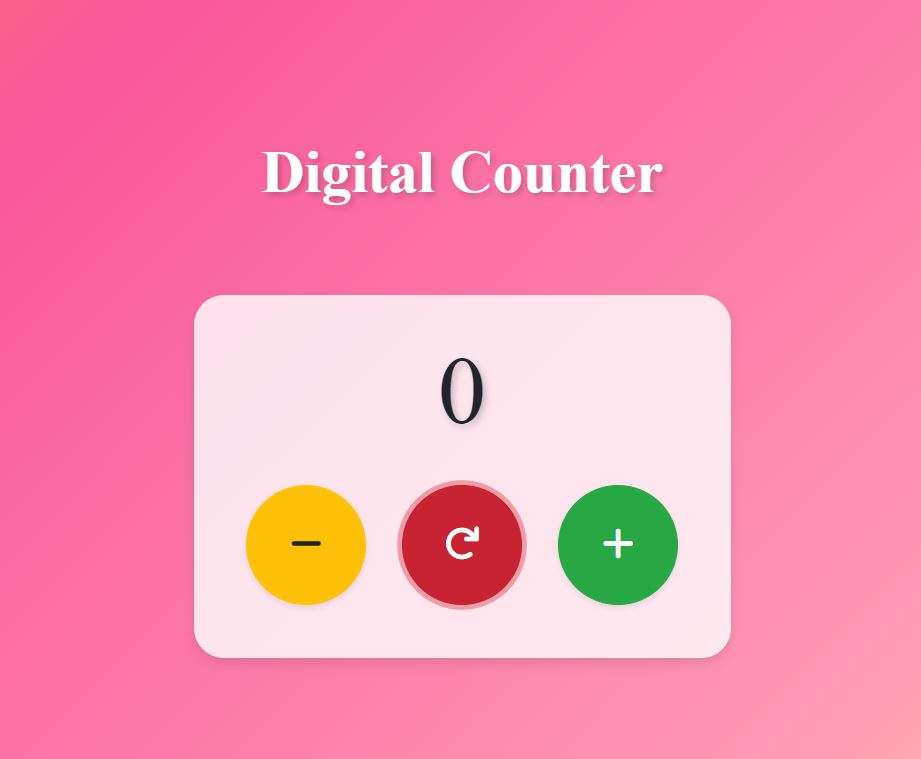

# Digital Counter

A simple and responsive web application for counting with increment, decrement, and reset features. Designed with HTML, CSS, JavaScript, and Bootstrap for a clean and user-friendly interface.

## How it Looks Like:



## Features

- **Increment**: Increase the counter value by 1.
- **Decrement**: Decrease the counter value by 1.
- **Reset**: Reset the counter value to 0.
- **Responsive Design**: Adaptable to various screen sizes, including mobile, tablet, laptop, and desktop.

## Technologies Used

- **HTML**: Structure and markup of the web application.
- **CSS**: Styling and layout adjustments; utilizes Bootstrap for responsiveness.
- **JavaScript**: Handles the functionality for counter operations and button interactions.
- **Bootstrap**: Provides responsive design and pre-built UI components.

## Getting Started

To get a local copy of the project up and running, follow these steps:

1. **Clone the repository:**

    ```bash
    git clone https://github.com/your-username/digital-counter.git
    ```

2. **Navigate to the project directory:**

    ```bash
    cd digital-counter
    ```

3. **Open `index.html` in your web browser to view the application.**

## Usage

- Click the **"+"** button to increment the counter.
- Click the **"-"** button to decrement the counter.
- Click the **"Reset"** button to set the counter back to 0.

## Contributing

Contributions are welcome! If you have suggestions for improvements or would like to contribute to the project, please follow these steps:

1. **Fork the repository**
2. **Create a new branch** (`git checkout -b feature-branch`)
3. **Make your changes**
4. **Commit your changes** (`git commit -am 'Add new feature'`)
5. **Push to the branch** (`git push origin feature-branch`)
6. **Create a new Pull Request**

## Author

Syed Abdul Rehman

